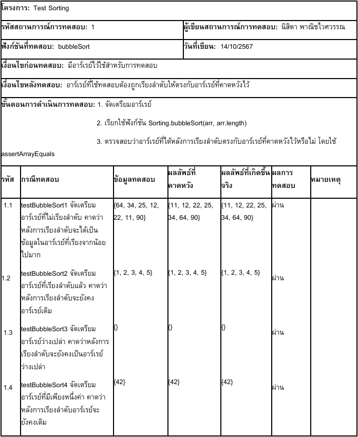
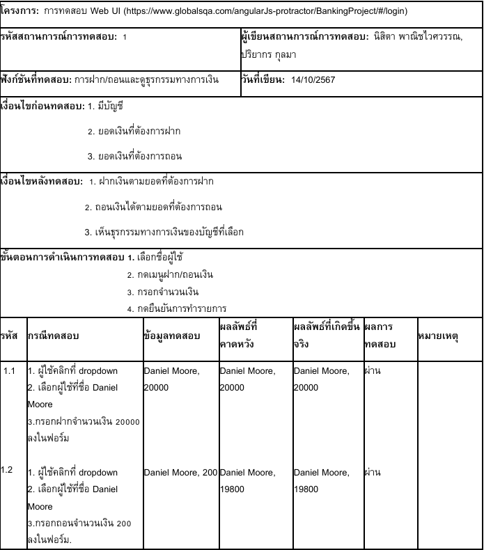
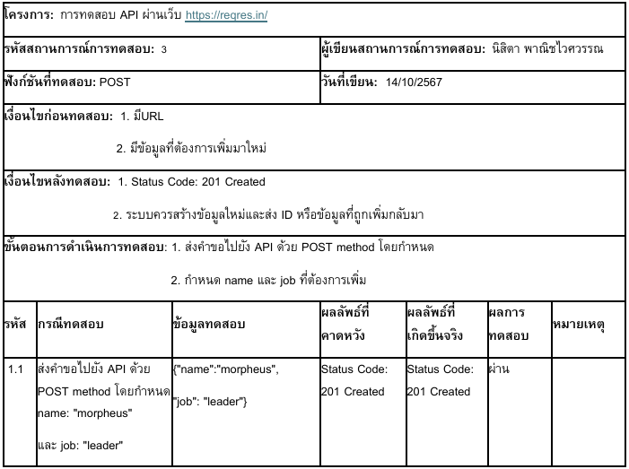

# Software Testing Showcase

A showcase of academic software testing work covering unit testing, web UI testing, API testing, and performance testing.

## Overview
This project presents testing scenarios created for different types of software testing, including Java unit testing with JUnit, web UI testing with Selenium, API testing with Postman, and performance testing for selected websites.

## My Role
- Designed and documented test scenarios
- Created test cases for Java methods and classes
- Contributed to web UI testing scenarios
- Worked on API testing with multiple HTTP methods
- Participated in performance testing analysis

## Testing Areas
- **Unit Testing:** JUnit test scenarios for Java programs
- **Web UI Testing:** Selenium-based scenarios for web applications
- **API Testing:** GET, POST, PUT, and DELETE testing with Postman
- **Performance Testing:** response time testing under concurrent usage conditions

## Tools Used
- JUnit
- Selenium
- Postman
- Performance testing tools
- Test scenario documentation

## Screenshots

### Unit Testing Example

### Web UI Testing Example

### API Testing Example

### Performance Testing Example

## Notes
This repository is intended for portfolio and educational showcase purposes. It focuses on testing design and test scenario documentation rather than a full deployable software product.

## Project Status
Academic Project  
Software Testing Course  
Kasetsart University Sriracha Campus
